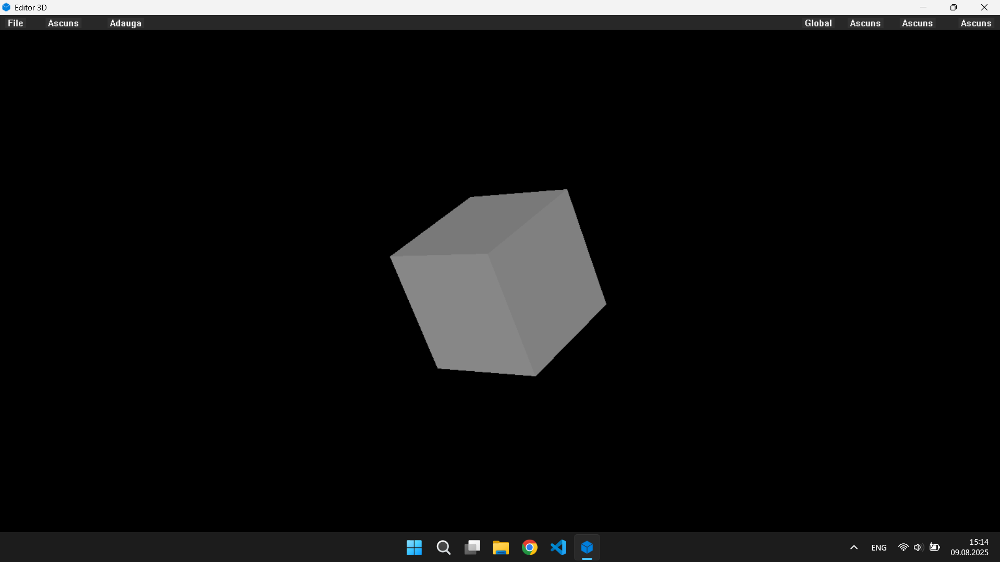
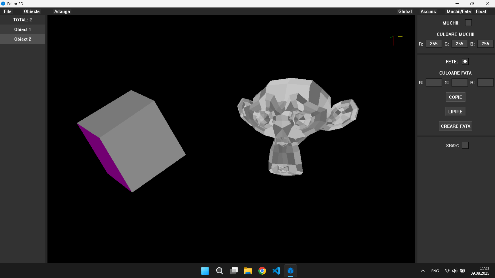
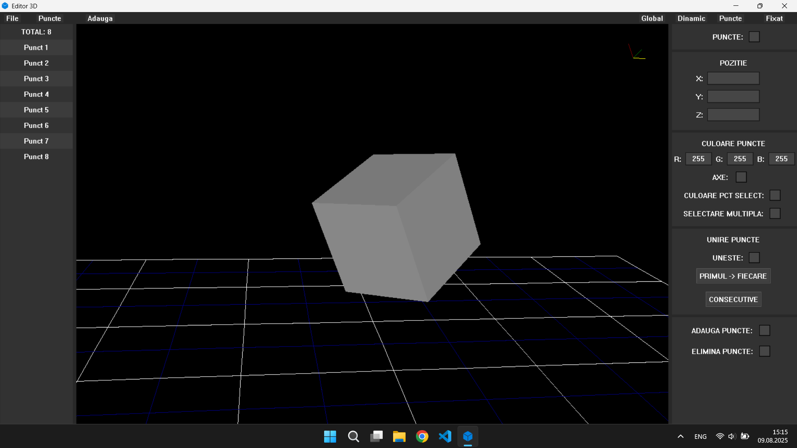
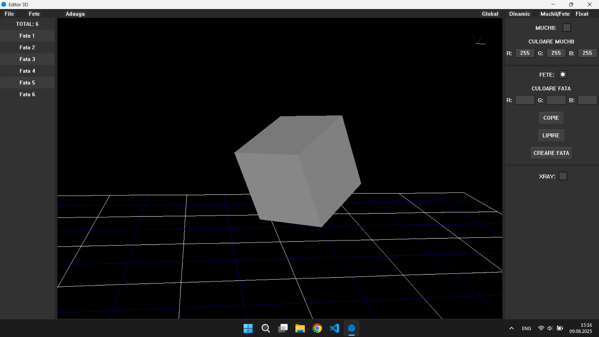
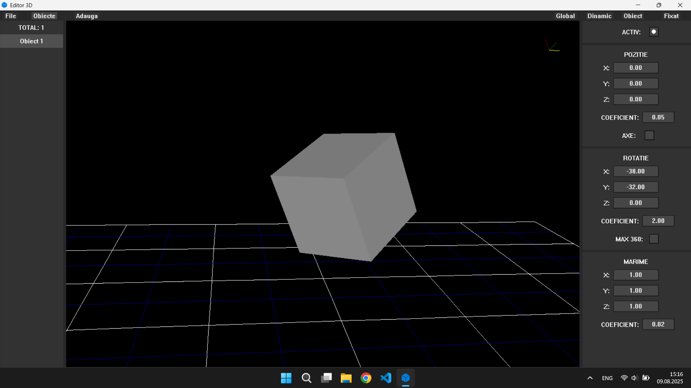
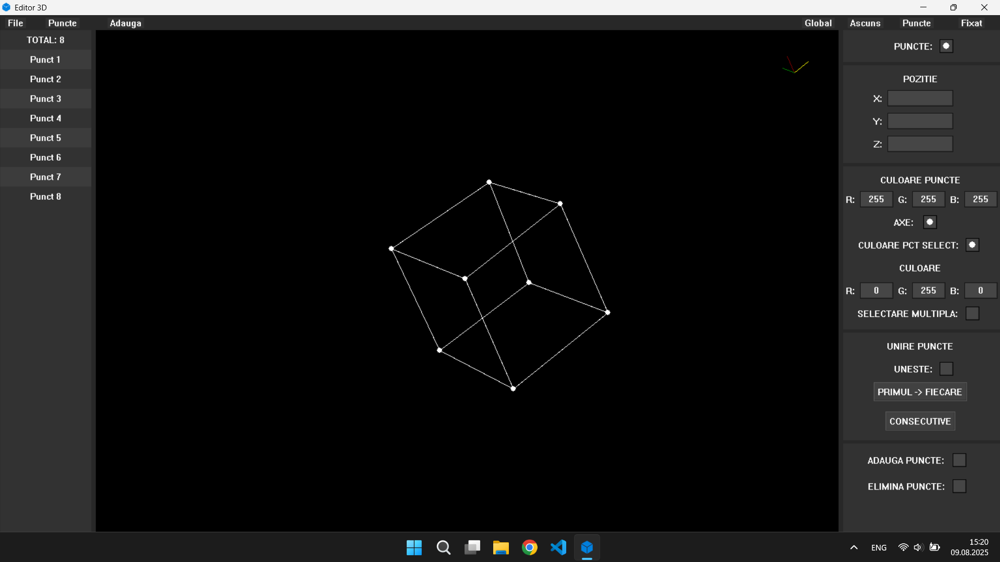
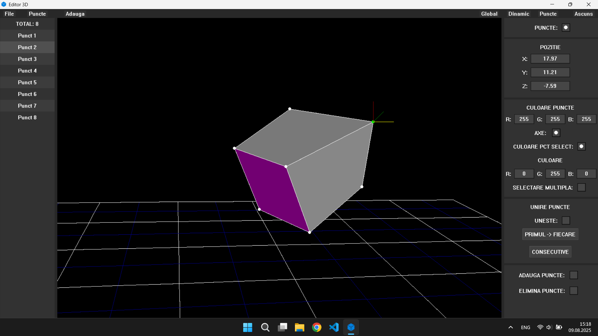

# Editor 3D

Editor 3D is a desktop application for Windows, written in C++, that allows you to view, edit, and manipulate simple 3D models using a graphical interface based on winbgim. The project is modular, with separate functionalities for transformations, polygons, undo/redo, file loading/saving, and drawing.

## 🛠️ Main Features
- **3D Model Visualization**: Displays 3D objects with the ability to rotate, translate, scale, and edit vertices, edges, and faces.
- **Interactive Editing**: Select and modify vertices, edges, faces, add/remove points, create polygons.
- **Undo/Redo**: Support for undoing/redoing editing actions.
- **Load/Save**: Support for .obj and .txt files, including predefined models.
- **Graphical Interface**: Command bar, side panels for editing, input boxes, buttons, and checkboxes.

## 📸 Screenshots
<table>
  <tr>
    <td align="center">
      <b>Main Window</b><br>
      
    </td>
    <td align="center">
      <b>Multiple Objects</b><br>
      
    </td>
  </tr>
  <tr>
    <td align="center">
      <b>Vertices Menu</b><br>
      
    </td>
    <td align="center">
      <b>Faces Menu</b><br>
      
    </td>
  </tr>
  <tr>
    <td align="center">
      <b>Objects Menu</b><br>
      
    </td>
    <td align="center">
      <b>xRay</b><br>
      
    </td>
  </tr>
  <tr>
    <td align="center" colspan="2">
      <b>Manipulation Axes</b><br>
      
    </td>
  </tr>
</table>

## 🗂️ Project structure

```
├── Editor_3D.cpp
├── Headers/
│   ├── Structuri.h         # Main data structures (Obiect, Punct3D, etc.)
│   ├── Deseneaza.h         # Drawing and UI functions
│   ├── Functionalitati.h   # Basic interaction functions
│   ├── Transformari.h      # Geometric transformations (rotation, scaling, translation)
│   ├── PoligonTools.h      # Polygon, vertex, edge operations
│   ├── UndoRedo.h          # Undo/redo functions
│   ├── Fisiere.h           # File loading/saving
│   ├── Utils.h             # Utility functions, operators, 2D/3D transforms
│   └── Model_data.h        # Predefined 3D models (cube, cone, cylinder, etc.)
├── Source/
│   ├── Deseneaza.cpp
│   ├── Functionalitati.cpp
│   ├── Transformari.cpp
│   ├── PoligonTools.cpp
│   ├── UndoRedo.cpp
│   ├── Fisiere.cpp
│   └── Utils.cpp
│
```

## 💡 Usage
- **Navigation**: 
    - Use the arrow keys to rotate the object on the X and Y axes, and `Z+left/right arrow` to rotate on the Z axis
    - Use `X+left/right arrow` to move the object on the X axis, `Y+up/down arrow` to move on the Y axis, and `Z+up/down arrow` to move on the Z axis
    - Use `X/Y/Z + '+' or '-'` to scale the object
- **Manipulation Axes**: Use the manipulation axes to easily edit the position of a point/object
- **Local and Global**: Use the button in the bar to switch between `Global` and `Local` transformation modes
- **Buttons and Inputs**: The graphical interface contains buttons for adding/removing points, creating polygons, undo/redo, point/face color, selected point color, face color, etc.
- **Menu Navigation**: Place the mouse in the points/faces/objects menu and use the `down arrow` and `up arrow` to navigate through all objects
- **Saving Objects**: Open the tab where objects are listed and select the objects you want to save using `Ctrl+Click` or `Ctrl+A` to select all objects in the project, then save them using the save button
- **Shortcuts**: 
  - `Ctrl+Z` / `Ctrl+Y` for Undo/Redo
  - `Q/E/W` for face navigation
  - `ALT` to rotate the grid
  - `Ctrl+Click` to add a point
  - `Delete` to delete selected points
  - `Ctrl+Delete` to delete selected objects

## 🚀 Download the application: [HERE](https://github.com/AndreiGhiorghies/Editor-3D/releases/download/v1.0.0/Editor_3D.exe)

## 🖥️ Requirements
- Windows
- 32-bit C++ compiler
- WinBGIm: [Installation tutorial](https://www.youtube.com/watch?v=QMom7QbX7IM&t)

## 🔧 Compilation
Compilation command:
```bash
g++ Editor_3D.cpp .\Icon\resource.o .\Source\*.cpp -o Editor_3D -IC:/bgi/include -LC:/bgi/lib -lbgi -lgdi32 -lcomdlg32 -luuid -loleaut32 -lole32 -lwinmm -mwindows  
```

## 📄 License
Open-source project under the MIT license.

